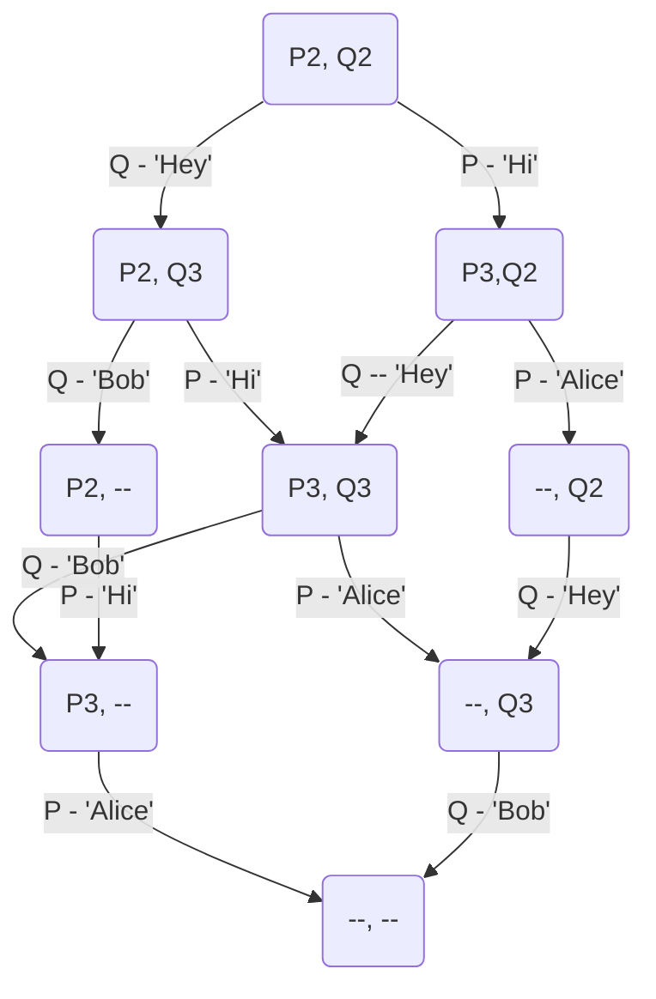
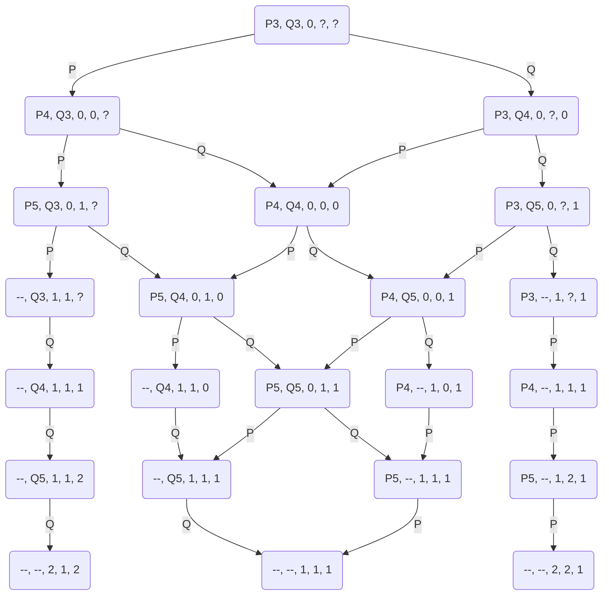
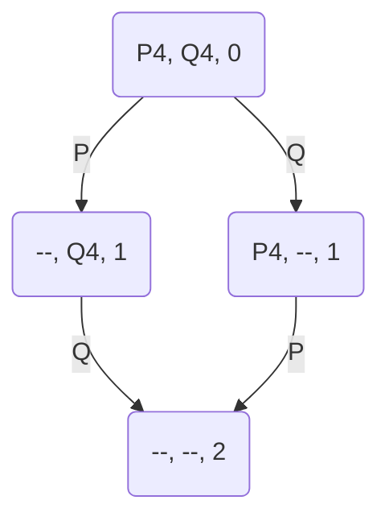
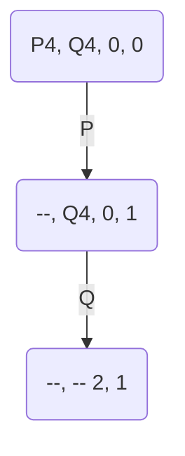

# Paths

## Exercise 1

---
State Format - {$IP_P, IP_Q$}

## Exercise 2.1

---
 $$\{IP_P, IP_Q, x, local_P, local_Q \}$$

## Exercise 2.2

---
$$\{ IP_P, IP_Q, x \}$$

## Exercise 3.1

---

$$\{ IP_P, IP_Q, x, y \}$$

## Exercise 3.2

---

No, there is not a path such that $x  = y = 1$

## Exercise 4

---

## Exercise 5

---

## Exercise 6

---

## Exercise 7

---

## Exercise 8

---
